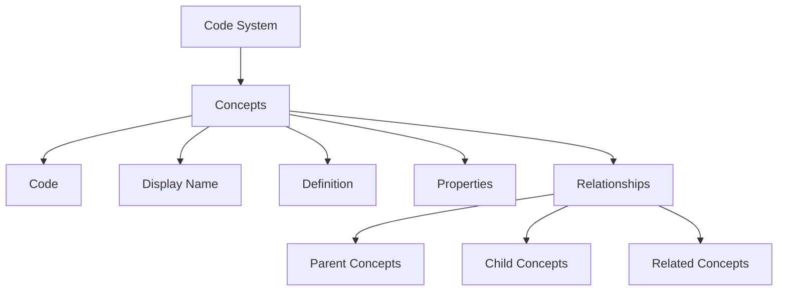

# Code Systems Overview

Code systems are the foundation of healthcare terminology. They define the concepts, codes, and relationships used to represent clinical information in a standardized way.

## What is a Code System?

A code system (also called a terminology or vocabulary) is a collection of concepts with unique codes. Each concept represents a specific clinical idea, such as a disease, procedure, or observation.

## Available Code Systems

### International Standards

<div class="grid cards" markdown>

-   :material-medical-bag:{ .lg .middle } **[SNOMED CT](snomed-ct.md)**

    ---

    Clinical terminology with 300,000+ concepts covering diseases, findings, procedures, and more.

-   :material-test-tube:{ .lg .middle } **[LOINC](loinc.md)**

    ---

    Laboratory and clinical observations with 90,000+ codes for tests and measurements.

-   :material-hospital-box:{ .lg .middle } **[ICD-10](icd-10.md)**

    ---

    International disease classification with 70,000+ diagnosis codes.

-   :material-pill:{ .lg .middle } **[RxNorm](rxnorm.md)**

    ---

    Medication terminology with 100,000+ drug concepts and relationships.

</div>

### Bangladesh FHIR Core

The Bangladesh FHIR Core provides country-specific code systems for local healthcare needs:

<div class="grid cards" markdown>

-   :material-water:{ .lg .middle } **[Blood Groups](bd-blood-groups.md)**

    ---

    **8 concepts** - ABO and Rh blood group classifications.

-   :material-hands-pray:{ .lg .middle } **[Religions](bd-religions.md)**

    ---

    **7 concepts** - Religious affiliations recognized in Bangladesh.

-   :material-briefcase:{ .lg .middle } **[Occupations](bd-occupations.md)**

    ---

    **71 concepts** - Occupation categories for demographic data.

-   :material-map-marker:{ .lg .middle } **[Geo Codes](bd-geocodes.md)**

    ---

    **1,591 concepts** - Complete geographic codes for Bangladesh (divisions, districts, upazilas, municipalities).

-   :material-pill:{ .lg .middle } **[Medications](bd-medication-code.md)**

    ---

    **6 concepts** - Common medications used in Bangladesh.

-   :material-needle:{ .lg .middle } **[Vaccines](bd-vaccine-code.md)**

    ---

    **10 concepts** - Vaccines in Bangladesh immunization programs.

-   :material-medication:{ .lg .middle } **[Dose Forms](bd-dose-form.md)**

    ---

    **10 concepts** - Pharmaceutical dose forms (tablets, capsules, etc.).

-   :material-card-account-details:{ .lg .middle } **[Identifier Types](bd-identifier-type.md)**

    ---

    **3 concepts** - Types of identifiers (NID, Birth Registration, etc.).

-   :material-alert:{ .lg .middle } **[Immunization Reaction](bd-immunization-reaction.md)**

    ---

    **6 concepts** - Adverse reactions to immunizations.

-   :material-needle:{ .lg .middle } **[Immunization Route](bd-immunization-route.md)**

    ---

    **5 concepts** - Routes of administration for vaccines.

-   :material-human:{ .lg .middle } **[Immunization Site](bd-immunization-site.md)**

    ---

    **5 concepts** - Body sites for vaccine administration.

-   :material-earth:{ .lg .middle } **[Country List](bd-country-list.md)**

    ---

    **188 concepts** - International country codes for nationality.

</div>

## Code System Statistics

| Category | Code Systems | Total Concepts |
|----------|--------------|----------------|
| International Standards | 4 | 460,000+ |
| Bangladesh Core | 12 | 1,910 |
| **Total** | **16** | **461,910+** |

## Code System Structure



## Using Code Systems

### In FHIR Resources

```json
{
  "resourceType": "Observation",
  "code": {
    "coding": [{
      "system": "http://loinc.org",
      "code": "8867-4",
      "display": "Heart rate"
    }]
  }
}
```

### With Bangladesh Core

```json
{
  "resourceType": "Patient",
  "extension": [{
    "url": "http://zarishsphere.org/fhir/StructureDefinition/religion",
    "valueCodeableConcept": {
      "coding": [{
        "system": "https://fhir.dghs.gov.bd/core/CodeSystem/bd-religions",
        "code": "1",
        "display": "Islam"
      }]
    }
  }]
}
```

## Code System Comparison

| Feature | SNOMED CT | LOINC | ICD-10 | Bangladesh Core |
|---------|-----------|-------|--------|-----------------|
| **Primary Use** | Clinical terms | Lab/Observations | Diagnoses | Local context |
| **Hierarchy** | Polyhierarchical | Flat | Hierarchical | Flat |
| **Granularity** | Very detailed | Detailed | Moderate | Specific |
| **Updates** | Biannual | Biannual | Annual | As needed |
| **Scope** | International | International | International | Bangladesh |

## Best Practices

!!! tip "Choosing the Right Code System"
    - Use **SNOMED CT** for detailed clinical documentation
    - Use **LOINC** for laboratory results and vital signs
    - Use **ICD-10** for diagnosis coding and billing
    - Use **Bangladesh Core** for local demographic and administrative data

!!! warning "Code System Versions"
    Always specify the code system version in production systems to ensure consistency.

!!! info "Multiple Codings"
    FHIR allows multiple codings for the same concept, enabling cross-system interoperability.

## Next Steps

- [Explore Value Sets](../valuesets/index.md)
- [Getting Started Guide](../guides/getting-started.md)
- [API Reference](../guides/api-reference.md)
