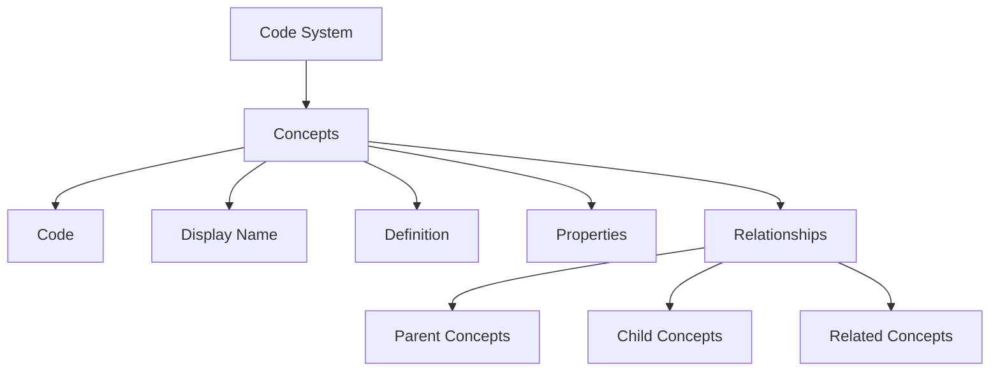

# Code Systems Overview

Code systems are the foundation of healthcare terminology. They define the concepts, codes, and relationships used to represent clinical information in a standardized way.

## What is a Code System?

A code system (also called a terminology or vocabulary) is a collection of concepts with unique codes. Each concept represents a specific clinical idea, such as a disease, procedure, or observation.

## Available Code Systems

### SNOMED CT

**Systematized Nomenclature of Medicine - Clinical Terms**

- **Concepts**: 300,000+
- **Coverage**: Diseases, findings, procedures, body structures, organisms
- **Use Cases**: Clinical documentation, decision support, analytics
- **URL**: `http://snomed.info/sct`

[Learn more about SNOMED CT →](snomed-ct.md)

### LOINC

**Logical Observation Identifiers Names and Codes**

- **Codes**: 90,000+
- **Coverage**: Laboratory tests, clinical observations, vital signs
- **Use Cases**: Lab results, vital signs, clinical measurements
- **URL**: `http://loinc.org`

[Learn more about LOINC →](loinc.md)

### ICD-10

**International Classification of Diseases, 10th Revision**

- **Codes**: 70,000+
- **Coverage**: Diseases, injuries, health conditions
- **Use Cases**: Diagnosis coding, billing, epidemiology
- **URL**: `http://hl7.org/fhir/sid/icd-10`

[Learn more about ICD-10 →](icd-10.md)

### RxNorm

**Normalized Naming System for Medications**

- **Concepts**: 100,000+
- **Coverage**: Medications, drug ingredients, dose forms
- **Use Cases**: Medication orders, prescriptions, drug databases
- **URL**: `http://www.nlm.nih.gov/research/umls/rxnorm`

[Learn more about RxNorm →](rxnorm.md)

## Code System Structure



## Using Code Systems

### In FHIR Resources

```json
{
  "resourceType": "Observation",
  "code": {
    "coding": [{
      "system": "http://loinc.org",
      "code": "8867-4",
      "display": "Heart rate"
    }]
  }
}
```

### Programmatically

```go
import "github.com/zarishsphere-platform/zarish-fhir-data/pkg/terminology"

// Load SNOMED CT
snomedCT, err := terminology.LoadCodeSystem("snomed-ct")

// Lookup a concept
concept := snomedCT.LookupCode("386661006") // Fever
```

## Code System Comparison

| Feature | SNOMED CT | LOINC | ICD-10 | RxNorm |
|---------|-----------|-------|--------|--------|
| **Primary Use** | Clinical terms | Lab/Observations | Diagnoses | Medications |
| **Hierarchy** | Polyhierarchical | Flat | Hierarchical | Hierarchical |
| **Granularity** | Very detailed | Detailed | Moderate | Detailed |
| **Updates** | Biannual | Biannual | Annual | Monthly |
| **License** | Free for use | Free | Free | Free |

## Best Practices

!!! tip "Choosing the Right Code System"
    - Use **SNOMED CT** for detailed clinical documentation
    - Use **LOINC** for laboratory results and vital signs
    - Use **ICD-10** for diagnosis coding and billing
    - Use **RxNorm** for medication orders and prescriptions

!!! warning "Code System Versions"
    Always specify the code system version in production systems to ensure consistency.

!!! info "Multiple Codings"
    FHIR allows multiple codings for the same concept, enabling cross-system interoperability.

## Next Steps

- [Explore Value Sets](../valuesets/index.md)
- [Getting Started Guide](../guides/getting-started.md)
- [API Reference](../guides/api-reference.md)
