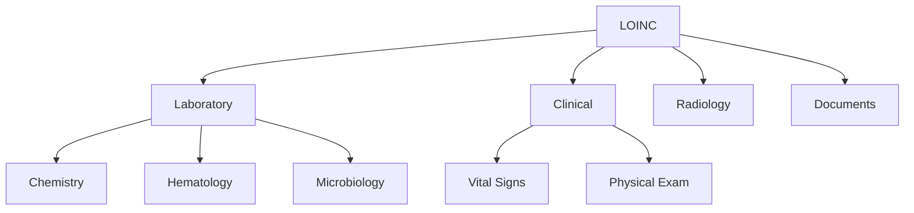
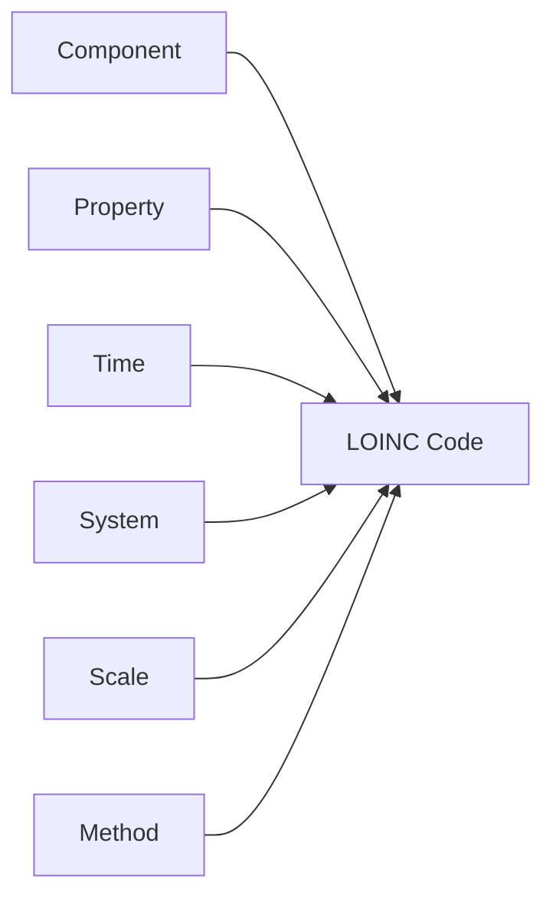

# LOINC - Laboratory Observations

**Logical Observation Identifiers Names and Codes**

LOINC is a universal standard for identifying medical laboratory observations. It provides a comprehensive set of codes for laboratory tests, clinical observations, and vital signs.

## Overview

- **Full Name**: Logical Observation Identifiers Names and Codes
- **Codes**: 90,000+ active codes
- **System URL**: `http://loinc.org`
- **Maintained By**: Regenstrief Institute
- **Update Frequency**: Biannual (June and December)

## Key Features

### Comprehensive Coverage

LOINC covers:
- **Laboratory Tests**: Chemistry, hematology, microbiology, serology
- **Clinical Observations**: Vital signs, physical findings
- **Radiology**: Imaging studies and reports
- **Clinical Documents**: Discharge summaries, progress notes
- **Survey Instruments**: Standardized questionnaires

### Hierarchical Organization



## Common LOINC Codes

### Vital Signs

| Code | Display Name | Units |
|------|-------------|-------|
| 8867-4 | Heart rate | beats/min |
| 8480-6 | Systolic blood pressure | mmHg |
| 8462-4 | Diastolic blood pressure | mmHg |
| 8310-5 | Body temperature | °C or °F |
| 9279-1 | Respiratory rate | breaths/min |
| 2708-6 | Oxygen saturation | % |
| 29463-7 | Body weight | kg or lb |
| 8302-2 | Body height | cm or in |
| 39156-5 | Body mass index (BMI) | kg/m² |

### Common Lab Tests

| Code | Display Name | Specimen |
|------|-------------|----------|
| 2345-7 | Glucose | Serum/Plasma |
| 2160-0 | Creatinine | Serum/Plasma |
| 6690-2 | White blood cell count | Blood |
| 789-8 | Erythrocytes | Blood |
| 718-7 | Hemoglobin | Blood |
| 4544-3 | Hematocrit | Blood |
| 777-3 | Platelets | Blood |
| 2951-2 | Sodium | Serum/Plasma |
| 2823-3 | Potassium | Serum/Plasma |

## Usage in FHIR

### Observation Resource

```json
{
  "resourceType": "Observation",
  "status": "final",
  "category": [{
    "coding": [{
      "system": "http://terminology.hl7.org/CodeSystem/observation-category",
      "code": "vital-signs"
    }]
  }],
  "code": {
    "coding": [{
      "system": "http://loinc.org",
      "code": "8867-4",
      "display": "Heart rate"
    }]
  },
  "subject": {
    "reference": "Patient/123"
  },
  "effectiveDateTime": "2024-11-24T10:00:00Z",
  "valueQuantity": {
    "value": 75,
    "unit": "beats/minute",
    "system": "http://unitsofmeasure.org",
    "code": "/min"
  }
}
```

### Laboratory Result

```json
{
  "resourceType": "Observation",
  "status": "final",
  "category": [{
    "coding": [{
      "system": "http://terminology.hl7.org/CodeSystem/observation-category",
      "code": "laboratory"
    }]
  }],
  "code": {
    "coding": [{
      "system": "http://loinc.org",
      "code": "2345-7",
      "display": "Glucose [Mass/volume] in Serum or Plasma"
    }]
  },
  "subject": {
    "reference": "Patient/123"
  },
  "valueQuantity": {
    "value": 95,
    "unit": "mg/dL",
    "system": "http://unitsofmeasure.org",
    "code": "mg/dL"
  },
  "referenceRange": [{
    "low": {
      "value": 70,
      "unit": "mg/dL"
    },
    "high": {
      "value": 100,
      "unit": "mg/dL"
    }
  }]
}
```

## LOINC Parts

LOINC codes are constructed from six main parts:



### Part Definitions

1. **Component**: What is being measured (e.g., Glucose, Hemoglobin)
2. **Property**: Type of measurement (e.g., Mass, Volume, Concentration)
3. **Time**: When measured (e.g., Point in time, 24 hour)
4. **System**: Where measured (e.g., Blood, Serum, Urine)
5. **Scale**: How measured (e.g., Quantitative, Ordinal, Nominal)
6. **Method**: Technique used (e.g., Automated, Manual)

## Searching LOINC

### By Code

```go
observation := loinc.LookupCode("8867-4")
// Returns: Heart rate
```

### By Component

```go
codes := loinc.SearchByComponent("glucose")
// Returns: All glucose-related codes
```

### By System

```go
codes := loinc.SearchBySystem("Serum")
// Returns: All serum-based tests
```

## Best Practices

!!! tip "Use Standard Units"
    Always use UCUM (Unified Code for Units of Measure) units with LOINC codes for consistency.

!!! warning "Version Awareness"
    LOINC codes can change between versions. Always specify the version in production systems.

!!! info "Panel Codes"
    LOINC includes panel codes that group related tests (e.g., Complete Blood Count panel).

## Integration with ZarishSphere

The ZarishSphere Platform uses LOINC for:
- Vital signs recording
- Laboratory test results
- Clinical observations
- Health assessments

## Resources

- [LOINC Official Website](https://loinc.org/)
- [LOINC Search](https://loinc.org/search/)
- [FHIR LOINC Module](https://www.hl7.org/fhir/loinc.html)
- [LOINC Users' Guide](https://loinc.org/kb/users-guide/)

## Next Steps

- [Explore Value Sets using LOINC](../valuesets/vital-signs.md)
- [View Other Code Systems](index.md)
- [API Reference](../guides/api-reference.md)
