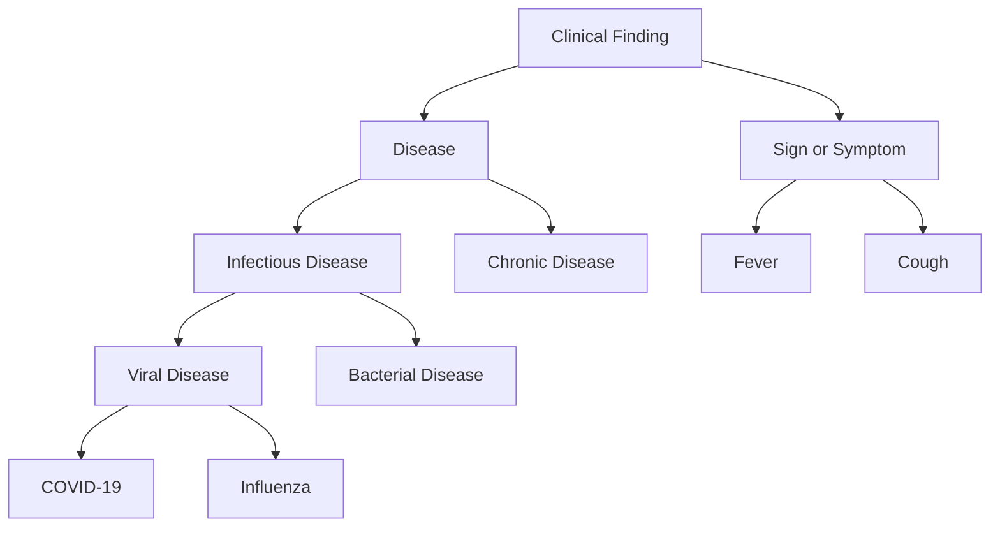
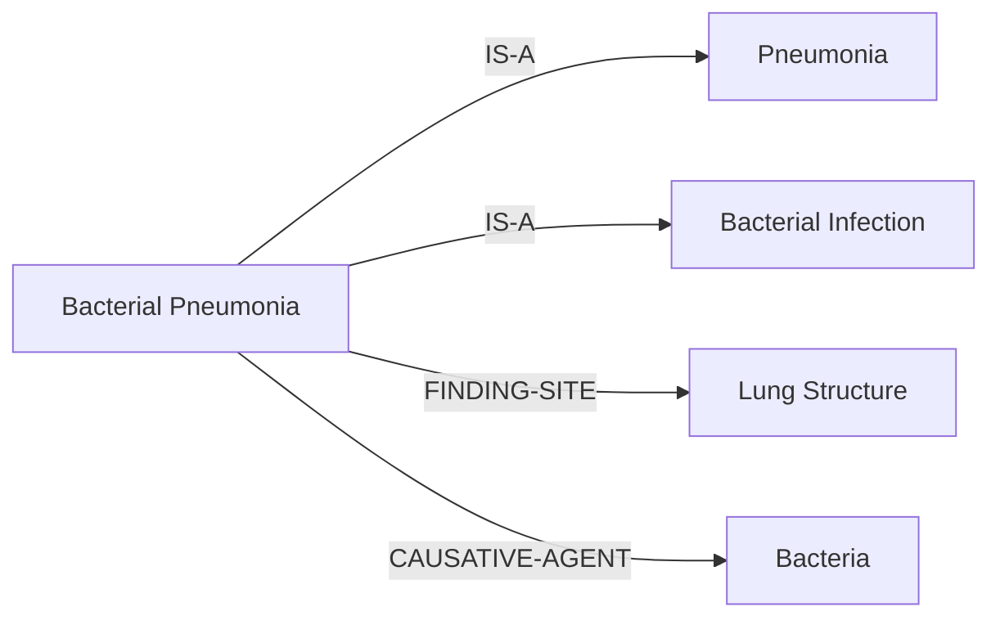
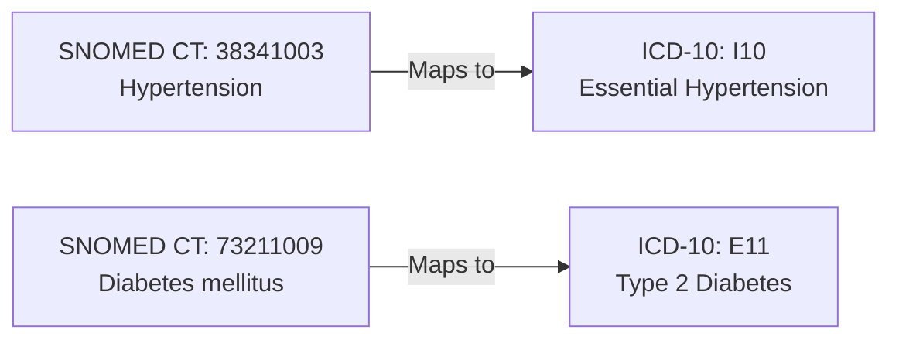

# SNOMED CT - Clinical Terminology

**Systematized Nomenclature of Medicine - Clinical Terms**

SNOMED CT is the most comprehensive and precise clinical health terminology in the world, providing a standardized way to represent clinical information.

## Overview

- **Full Name**: Systematized Nomenclature of Medicine - Clinical Terms
- **Concepts**: 300,000+ active concepts
- **Relationships**: 1,000,000+ relationships between concepts
- **System URL**: `http://snomed.info/sct`
- **Maintained By**: SNOMED International
- **Update Frequency**: Biannual (January and July)

## Key Features

### Comprehensive Coverage

SNOMED CT covers a wide range of clinical domains:

- **Clinical Findings**: Diseases, symptoms, signs
- **Procedures**: Surgical, diagnostic, therapeutic procedures
- **Body Structures**: Anatomical locations and structures
- **Organisms**: Bacteria, viruses, parasites
- **Substances**: Drugs, chemicals, biological substances
- **Pharmaceutical Products**: Medications and drug products

### Polyhierarchical Structure



## Common SNOMED CT Concepts

### Vital Signs

| Code | Display Name | Definition |
|------|-------------|------------|
| 386725007 | Body temperature | The measured temperature of the body |
| 271649006 | Systolic blood pressure | The maximum arterial pressure during contraction |
| 271650006 | Diastolic blood pressure | The minimum arterial pressure during relaxation |
| 364075005 | Heart rate | The number of heartbeats per minute |
| 86290005 | Respiratory rate | The number of breaths per minute |

### Common Conditions

| Code | Display Name | Category |
|------|-------------|----------|
| 38341003 | Hypertension | Cardiovascular |
| 73211009 | Diabetes mellitus | Endocrine |
| 195967001 | Asthma | Respiratory |
| 13645005 | Chronic obstructive pulmonary disease | Respiratory |
| 386661006 | Fever | Symptom |

## Usage Examples

### In FHIR Observation

```json
{
  "resourceType": "Observation",
  "status": "final",
  "code": {
    "coding": [{
      "system": "http://snomed.info/sct",
      "code": "386725007",
      "display": "Body temperature"
    }]
  },
  "valueQuantity": {
    "value": 37.5,
    "unit": "°C",
    "system": "http://unitsofmeasure.org",
    "code": "Cel"
  }
}
```

### In FHIR Condition

```json
{
  "resourceType": "Condition",
  "code": {
    "coding": [{
      "system": "http://snomed.info/sct",
      "code": "38341003",
      "display": "Hypertension"
    }]
  },
  "subject": {
    "reference": "Patient/123"
  }
}
```

## Concept Relationships

SNOMED CT uses relationships to connect concepts:



### Relationship Types

- **IS-A**: Hierarchical relationship (subtype)
- **FINDING-SITE**: Anatomical location
- **CAUSATIVE-AGENT**: Etiological agent
- **ASSOCIATED-MORPHOLOGY**: Structural change
- **PROCEDURE-SITE**: Location of procedure

## Searching SNOMED CT

### By Code

```go
concept := snomedCT.LookupCode("386661006")
// Returns: Fever
```

### By Description

```go
concepts := snomedCT.Search("diabetes")
// Returns: Diabetes mellitus, Diabetic retinopathy, etc.
```

### By Hierarchy

```go
children := snomedCT.GetChildren("64572001") // Disease
// Returns: Infectious disease, Chronic disease, etc.
```

## Best Practices

!!! tip "Use Specific Concepts"
    Always use the most specific concept available. For example, use "Type 2 diabetes mellitus" instead of just "Diabetes mellitus".

!!! warning "Post-Coordination"
    SNOMED CT supports post-coordination (combining concepts), but use pre-coordinated concepts when available for better interoperability.

!!! info "Versioning"
    Specify the SNOMED CT version in production systems:
    ```
    http://snomed.info/sct/900000000000207008/version/20240101
    ```

## Integration with Other Systems

### SNOMED CT to ICD-10 Mapping



## Resources

- [SNOMED International Browser](https://browser.ihtsdotools.org/)
- [SNOMED CT Starter Guide](https://www.snomed.org/snomed-ct/get-started)
- [FHIR SNOMED CT Module](https://www.hl7.org/fhir/snomedct.html)

## Next Steps

- [Explore Value Sets using SNOMED CT](../valuesets/index.md)
- [Learn about other Code Systems](index.md)
- [API Reference](../guides/api-reference.md)
