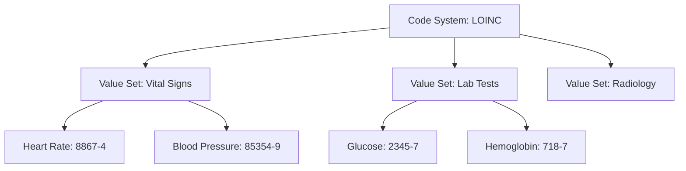

# Using Terminologies

This guide explains how to effectively use FHIR terminologies in your healthcare applications.

## Understanding Terminologies

### Code Systems vs Value Sets

**Code System**: The complete set of all possible codes
- Example: SNOMED CT contains 300,000+ clinical concepts

**Value Set**: A curated subset of codes for a specific use case
- Example: "Vital Signs" value set contains only codes for vital sign measurements



## Common Patterns

### 1. Patient Demographics

```json
{
  "resourceType": "Patient",
  "extension": [
    {
      "url": "http://zarishsphere.org/fhir/StructureDefinition/blood-group",
      "valueCodeableConcept": {
        "coding": [{
          "system": "https://fhir.dghs.gov.bd/core/CodeSystem/bd-blood-groups",
          "code": "1",
          "display": "O Positive"
        }]
      }
    },
    {
      "url": "http://zarishsphere.org/fhir/StructureDefinition/religion",
      "valueCodeableConcept": {
        "coding": [{
          "system": "https://fhir.dghs.gov.bd/core/CodeSystem/bd-religions",
          "code": "1",
          "display": "Islam"
        }]
      }
    },
    {
      "url": "http://zarishsphere.org/fhir/StructureDefinition/occupation",
      "valueCodeableConcept": {
        "coding": [{
          "system": "https://fhir.dghs.gov.bd/core/CodeSystem/bd-occupations",
          "code": "1",
          "display": "Farmer"
        }]
      }
    }
  ]
}
```

### 2. Vital Signs

```json
{
  "resourceType": "Observation",
  "status": "final",
  "category": [{
    "coding": [{
      "system": "http://terminology.hl7.org/CodeSystem/observation-category",
      "code": "vital-signs"
    }]
  }],
  "code": {
    "coding": [
      {
        "system": "http://loinc.org",
        "code": "85354-9",
        "display": "Blood pressure panel"
      }
    ]
  },
  "component": [
    {
      "code": {
        "coding": [{
          "system": "http://loinc.org",
          "code": "8480-6",
          "display": "Systolic blood pressure"
        }]
      },
      "valueQuantity": {
        "value": 120,
        "unit": "mmHg",
        "system": "http://unitsofmeasure.org",
        "code": "mm[Hg]"
      }
    },
    {
      "code": {
        "coding": [{
          "system": "http://loinc.org",
          "code": "8462-4",
          "display": "Diastolic blood pressure"
        }]
      },
      "valueQuantity": {
        "value": 80,
        "unit": "mmHg",
        "system": "http://unitsofmeasure.org",
        "code": "mm[Hg]"
      }
    }
  ]
}
```

### 3. Medications

```json
{
  "resourceType": "MedicationRequest",
  "status": "active",
  "intent": "order",
  "medicationCodeableConcept": {
    "coding": [{
      "system": "https://fhir.dghs.gov.bd/core/CodeSystem/bd-medication-code",
      "code": "1",
      "display": "Paracetamol"
    }]
  },
  "dosageInstruction": [{
    "doseAndRate": [{
      "doseQuantity": {
        "value": 500,
        "unit": "mg"
      }
    }],
    "route": {
      "coding": [{
        "system": "http://snomed.info/sct",
        "code": "26643006",
        "display": "Oral route"
      }]
    }
  }]
}
```

### 4. Immunizations

```json
{
  "resourceType": "Immunization",
  "status": "completed",
  "vaccineCode": {
    "coding": [{
      "system": "https://fhir.dghs.gov.bd/core/CodeSystem/bd-vaccine-code",
      "code": "1",
      "display": "BCG"
    }]
  },
  "patient": {
    "reference": "Patient/123"
  },
  "occurrenceDateTime": "2024-01-15",
  "route": {
    "coding": [{
      "system": "https://fhir.dghs.gov.bd/core/CodeSystem/bd-immunization-route",
      "code": "1",
      "display": "Intradermal"
    }]
  },
  "site": {
    "coding": [{
      "system": "https://fhir.dghs.gov.bd/core/CodeSystem/bd-immunization-site",
      "code": "1",
      "display": "Left upper arm"
    }]
  }
}
```

## Multiple Codings

Use multiple codings to provide both local and international codes:

```json
{
  "code": {
    "coding": [
      {
        "system": "http://snomed.info/sct",
        "code": "38341003",
        "display": "Hypertension"
      },
      {
        "system": "http://hl7.org/fhir/sid/icd-10",
        "code": "I10",
        "display": "Essential (primary) hypertension"
      }
    ],
    "text": "High Blood Pressure"
  }
}
```

## Terminology Binding

### Required Binding

Must use a code from the specified value set:

```json
{
  "status": "final",  // REQUIRED: must be from ObservationStatus value set
  "code": { ... }
}
```

### Extensible Binding

Should use a code from the value set, but can use others if needed:

```json
{
  "category": [{
    "coding": [{
      "system": "http://terminology.hl7.org/CodeSystem/observation-category",
      "code": "vital-signs"  // EXTENSIBLE: preferred but not required
    }]
  }]
}
```

### Preferred Binding

Suggested to use codes from the value set:

```json
{
  "interpretation": [{
    "coding": [{
      "system": "http://terminology.hl7.org/CodeSystem/v3-ObservationInterpretation",
      "code": "H",  // PREFERRED: suggested but optional
      "display": "High"
    }]
  }]
}
```

## Searching and Filtering

### Search by Code

```http
GET /Observation?code=http://loinc.org|8867-4
```

### Search by Code System

```http
GET /Observation?code:in=http://loinc.org
```

### Search by Value Set

```http
GET /Observation?code:in=http://hl7.org/fhir/ValueSet/observation-vitalsignresult
```

## Best Practices

!!! tip "Use Standard Terminologies"
    Prefer international standards (SNOMED CT, LOINC, ICD-10) for maximum interoperability.

!!! tip "Provide Display Names"
    Always include the display name with codes for human readability.

!!! warning "Version Awareness"
    Specify code system versions in production to ensure consistency over time.

!!! info "Text Fallback"
    Include a human-readable text element as a fallback when codes might not be understood.

## Common Mistakes

### ❌ Missing System

```json
{
  "coding": [{
    "code": "8867-4",  // Missing system!
    "display": "Heart rate"
  }]
}
```

### ✅ Correct

```json
{
  "coding": [{
    "system": "http://loinc.org",
    "code": "8867-4",
    "display": "Heart rate"
  }]
}
```

### ❌ Wrong Value Set

```json
{
  "vaccineCode": {
    "coding": [{
      "system": "https://fhir.dghs.gov.bd/core/CodeSystem/bd-medication-code",  // Wrong!
      "code": "1"
    }]
  }
}
```

### ✅ Correct

```json
{
  "vaccineCode": {
    "coding": [{
      "system": "https://fhir.dghs.gov.bd/core/CodeSystem/bd-vaccine-code",  // Correct!
      "code": "1",
      "display": "BCG"
    }]
  }
}
```

## Next Steps

- [Code Systems Reference](../codesystems/index.md)
- [Value Sets Reference](../valuesets/index.md)
- [API Reference](api-reference.md)
- [Contributing Guide](contributing.md)
