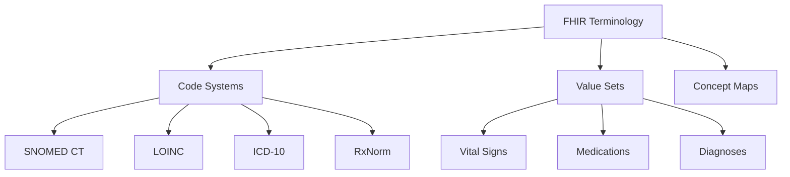

# Welcome to Zarish FHIR Data Documentation

**Comprehensive FHIR Terminology Resources for Healthcare Data Management**

Welcome to the Zarish FHIR Data documentation! This repository provides a comprehensive collection of FHIR-compliant terminology resources, code systems, and value sets for healthcare data management.

## 🎯 What is Zarish FHIR Data?

Zarish FHIR Data is the central terminology repository for the ZarishSphere Platform, containing:

- **Code Systems**: Standardized medical terminologies (SNOMED CT, LOINC, ICD-10, RxNorm)
- **Value Sets**: Curated collections of codes for specific use cases
- **Concept Maps**: Mappings between different terminology systems
- **Reference Data**: Sample FHIR resources and examples

## 🚀 Quick Start

### Installation

```bash
git clone https://github.com/ZarishSphere-Platform/zarish-fhir-data.git
cd zarish-fhir-data
go mod download
```

### Using the Data

```go
import "github.com/zarishsphere-platform/zarish-fhir-data/pkg/terminology"

// Load a code system
cs, err := terminology.LoadCodeSystem("snomed-ct")

// Load a value set
vs, err := terminology.LoadValueSet("vital-signs")
```

## 📚 Available Resources

### Code Systems

<div class="grid cards" markdown>

-   :material-medical-bag:{ .lg .middle } **SNOMED CT**

    ---

    Clinical terminology with 300,000+ concepts covering diseases, findings, procedures, and more.

    [:octicons-arrow-right-24: Learn more](codesystems/snomed-ct.md)

-   :material-test-tube:{ .lg .middle } **LOINC**

    ---

    Laboratory and clinical observations with 90,000+ codes for tests and measurements.

    [:octicons-arrow-right-24: Learn more](codesystems/loinc.md)

-   :material-hospital-box:{ .lg .middle } **ICD-10**

    ---

    International disease classification with 70,000+ diagnosis codes.

    [:octicons-arrow-right-24: Learn more](codesystems/icd-10.md)

-   :material-pill:{ .lg .middle } **RxNorm**

    ---

    Medication terminology with 100,000+ drug concepts and relationships.

    [:octicons-arrow-right-24: Learn more](codesystems/rxnorm.md)

</div>

### Value Sets

Browse our curated value sets for common clinical scenarios:

- [Vital Signs](valuesets/vital-signs.md) - Blood pressure, temperature, heart rate, etc.
- [Medications](valuesets/medications.md) - Common medications and drug classes
- [Diagnoses](valuesets/diagnoses.md) - Frequently used diagnosis codes
- [Procedures](valuesets/procedures.md) - Medical procedures and interventions

## 🔍 Interactive Features

### Terminology Browser

Explore our interactive terminology browser to search and navigate through code systems and value sets.

### Mermaid Diagrams

Visualize terminology hierarchies and relationships with interactive Mermaid diagrams.



## 📖 Documentation Sections

<div class="grid cards" markdown>

-   :material-book-open-variant:{ .lg .middle } **Code Systems**

    ---

    Detailed documentation for each code system including structure, usage, and examples.

    [:octicons-arrow-right-24: Browse Code Systems](codesystems/index.md)

-   :material-format-list-bulleted:{ .lg .middle } **Value Sets**

    ---

    Curated collections of codes for specific clinical use cases.

    [:octicons-arrow-right-24: Browse Value Sets](valuesets/index.md)

-   :material-book-education:{ .lg .middle } **Guides**

    ---

    Step-by-step guides for using terminologies in your applications.

    [:octicons-arrow-right-24: View Guides](guides/getting-started.md)

</div>

## 🌐 FHIR Compliance

All resources comply with:

- **FHIR Version**: R4 (4.0.1)
- **Validation**: FHIR Validator conformance
- **Standards**: HL7 FHIR Terminology Services

## 🤝 Contributing

We welcome contributions! See our [Contributing Guide](guides/contributing.md) for details.

## 🔗 Related Projects

- [Zarish FHIR Server](https://github.com/ZarishSphere-Platform/zarish-fhir-server) - FHIR API Server
- [Zarish Terminology Server](https://github.com/ZarishSphere-Platform/zarish-terminology-server) - Terminology Services
- [Zarish FHIR Profiles](https://zarishsphere-platform.github.io/zarish-fhir-profiles/) - Profile Definitions

## 📄 License

This project is part of the ZarishSphere Platform.

---

**Ready to get started?** Check out our [Getting Started Guide](guides/getting-started.md)!
