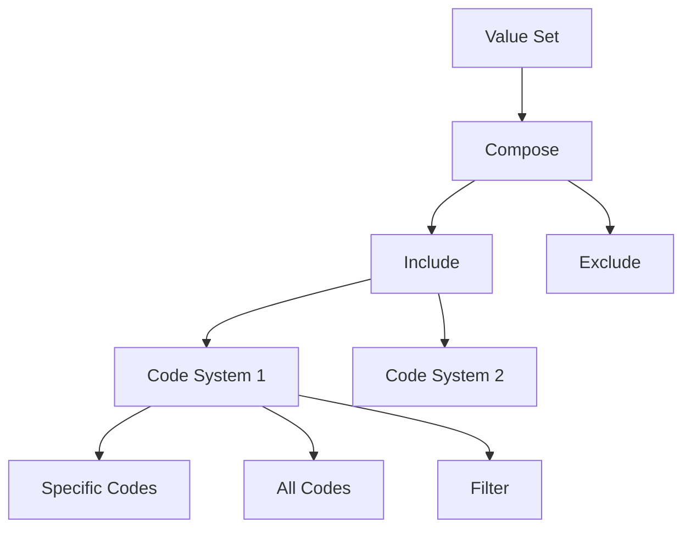

# Value Sets Overview

Value sets are curated collections of codes from one or more code systems. They define which codes are valid for a particular use case or context.

## What is a Value Set?

A value set is a selection of codes from code systems that are appropriate for use in a specific context. For example, a "Blood Type" value set would include only the codes for different blood types from a blood group code system.

## Available Value Sets

### Clinical Value Sets

<div class="grid cards" markdown>

-   :material-water:{ .lg .middle } **[Blood Groups](bd-blood-group-valueset.md)**

    ---

    ABO and Rh blood group classifications for patient records and transfusion management.

-   :material-pill:{ .lg .middle } **[Medications](bd-medication-valueset.md)**

    ---

    Common medications used in Bangladesh healthcare facilities.

-   :material-needle:{ .lg .middle } **[Vaccines](bd-vaccine-valueset.md)**

    ---

    Vaccines administered in Bangladesh immunization programs.

-   :material-medication:{ .lg .middle } **[Dose Forms](bd-dose-form-valueset.md)**

    ---

    Pharmaceutical dose forms (tablets, capsules, injections, etc.).

-   :material-hospital-box:{ .lg .middle } **[ICD-11 Conditions](bd-condition-icd11-valueset.md)**

    ---

    Disease and condition codes based on ICD-11 classification.

</div>

### Demographics Value Sets

<div class="grid cards" markdown>

-   :material-hands-pray:{ .lg .middle } **[Religions](bd-religions-valueset.md)**

    ---

    Religious affiliations recognized in Bangladesh.

-   :material-briefcase:{ .lg .middle } **[Occupations](bd-occupations-valueset.md)**

    ---

    71 occupation categories for patient demographic data.

-   :material-translate:{ .lg .middle } **[Languages](bd-language-valueset.md)**

    ---

    Languages spoken in Bangladesh and internationally.

-   :material-earth:{ .lg .middle } **[Countries](bd-country-list-valueset.md)**

    ---

    International country codes for nationality and address.

</div>

### Geographic Value Sets

<div class="grid cards" markdown>

-   :material-map-marker:{ .lg .middle } **[Divisions](bd-division-code-valueset.md)**

    ---

    8 administrative divisions of Bangladesh.

-   :material-city:{ .lg .middle } **[Districts](bd-district-code-valueset.md)**

    ---

    64 districts across Bangladesh.

-   :material-home-city:{ .lg .middle } **[Upazilas](bd-upazilla-code-valueset.md)**

    ---

    Sub-district level administrative units.

-   :material-office-building:{ .lg .middle } **[City Corporations](bd-city-corporation-code-valueset.md)**

    ---

    Major city corporations in Bangladesh.

-   :material-town-hall:{ .lg .middle } **[Municipalities](bd-municipalities-code-valueset.md)**

    ---

    Municipality codes for urban areas.

</div>

### Administrative Value Sets

<div class="grid cards" markdown>

-   :material-card-account-details:{ .lg .middle } **[Identifier Types](bd-identifier-type-valueset.md)**

    ---

    Types of identifiers used in Bangladesh healthcare (NID, Birth Registration, etc.).

-   :material-hospital:{ .lg .middle } **[Encounter Class](bd-encounter-class-subset.md)**

    ---

    Types of patient encounters (inpatient, outpatient, emergency).

-   :material-clipboard-check:{ .lg .middle } **[Encounter Status](bd-encounter-status-subset.md)**

    ---

    Status values for patient encounters.

</div>

### Immunization Value Sets

<div class="grid cards" markdown>

-   :material-alert:{ .lg .middle } **[Immunization Reaction](bd-immunization-reaction-valueset.md)**

    ---

    Adverse reactions to immunizations.

-   :material-needle:{ .lg .middle } **[Immunization Route](bd-immunization-route-valueset.md)**

    ---

    Routes of administration for vaccines.

-   :material-human:{ .lg .middle } **[Immunization Site](bd-immunization-site-valueset.md)**

    ---

    Body sites for vaccine administration.

</div>

## Value Set Structure



## Using Value Sets

### In FHIR Resources

```json
{
  "resourceType": "Patient",
  "extension": [{
    "url": "http://zarishsphere.org/fhir/StructureDefinition/religion",
    "valueCodeableConcept": {
      "coding": [{
        "system": "https://fhir.dghs.gov.bd/core/CodeSystem/bd-religions",
        "code": "1",
        "display": "Islam"
      }]
    }
  }]
}
```

### Validation

Value sets are used to validate that codes used in FHIR resources are appropriate for the context:

```go
// Validate a code against a value set
valid := valueSet.ValidateCode("https://fhir.dghs.gov.bd/core/CodeSystem/bd-religions", "1")
```

## Value Set Categories

| Category | Count | Description |
|----------|-------|-------------|
| Clinical | 5 | Medical and pharmaceutical value sets |
| Demographics | 4 | Patient demographic information |
| Geographic | 5 | Bangladesh administrative divisions |
| Administrative | 3 | Healthcare administration |
| Immunization | 3 | Vaccination-related codes |

## Best Practices

!!! tip "Use Appropriate Value Sets"
    Always use the most specific value set available for your use case. For example, use the Bangladesh-specific value sets for local implementations.

!!! warning "Version Binding"
    Specify whether your binding to a value set is "required", "extensible", or "preferred" based on your needs.

!!! info "Expansion"
    Value sets can be expanded to show all included codes at a specific point in time.

## Next Steps

- [Explore Code Systems](../codesystems/index.md)
- [Getting Started Guide](../guides/getting-started.md)
- [API Reference](../guides/api-reference.md)
